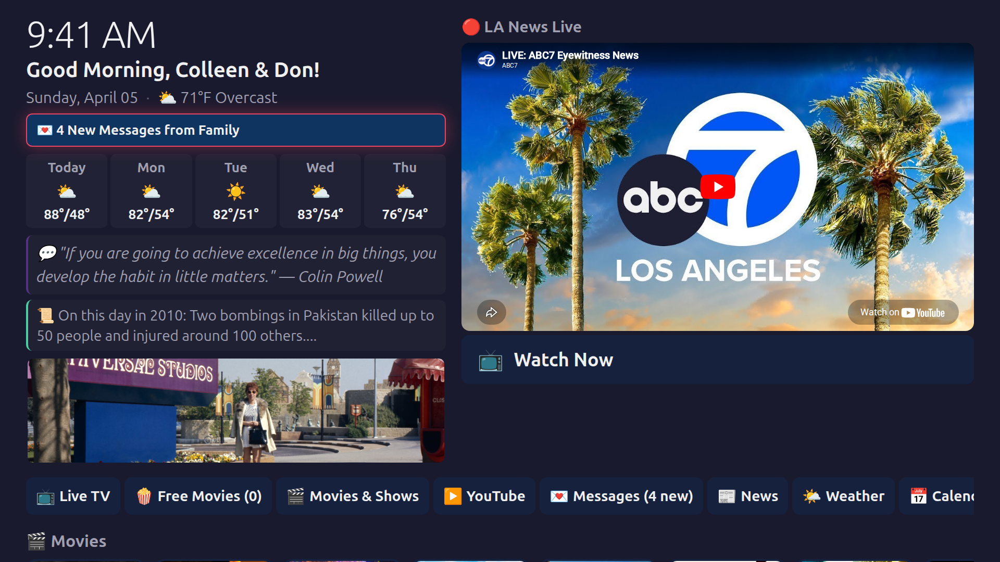
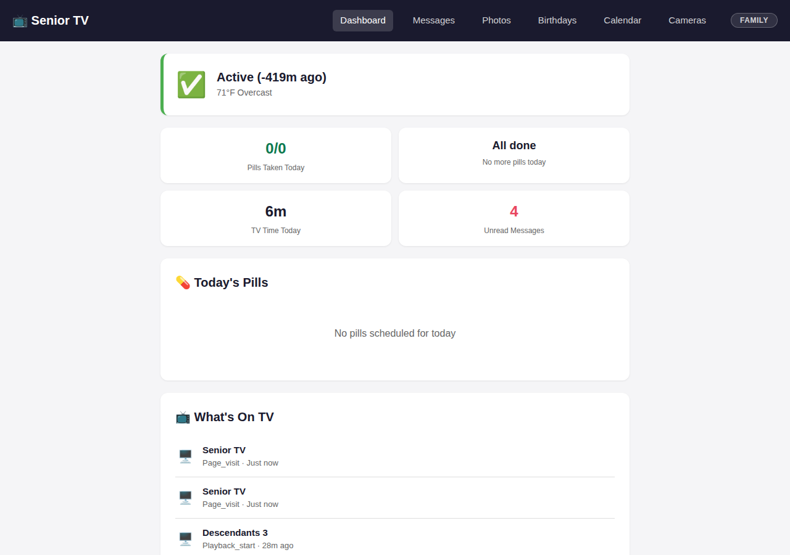
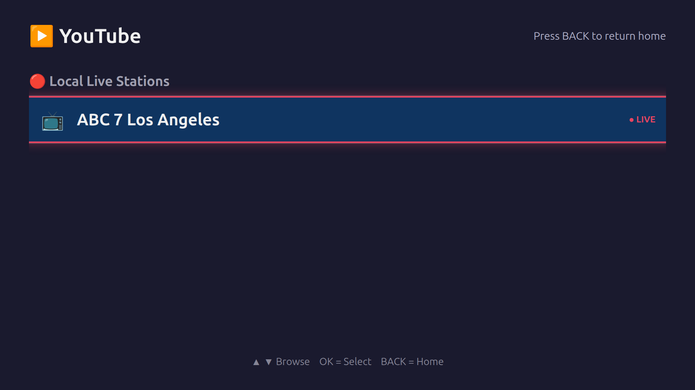
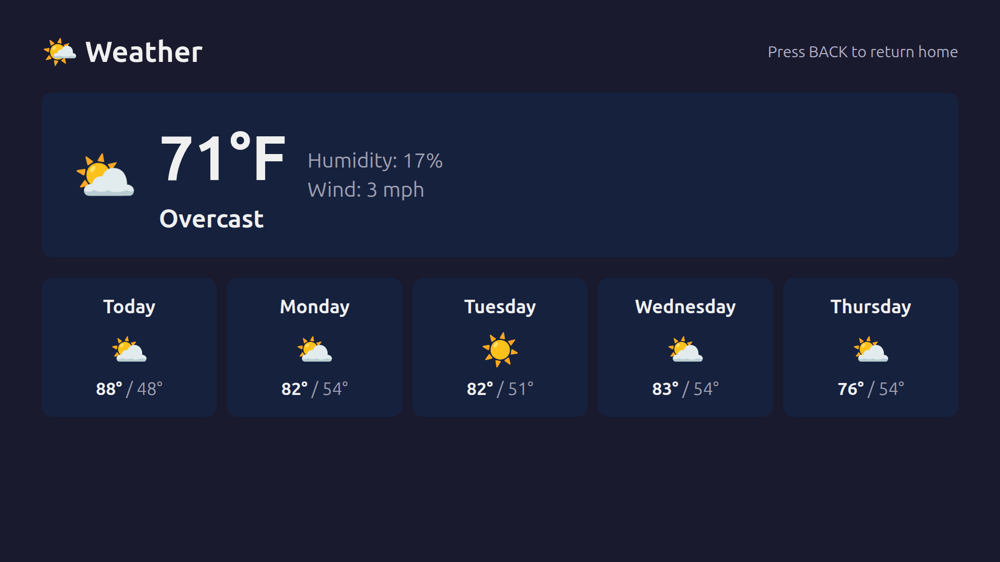
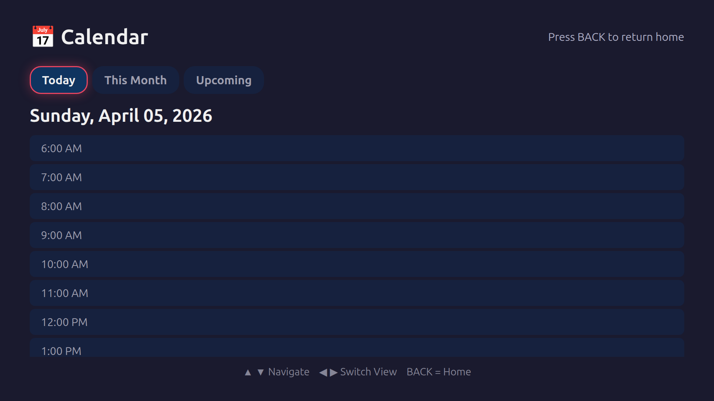
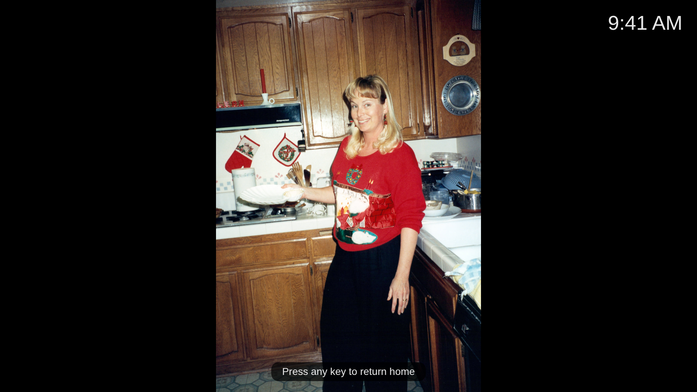

<p align="center">
  
  
  
  
  
</p>

<h1 align="center">Senior TV</h1>

<p align="center">
  <strong>Open-source kiosk entertainment, care, and communication system for seniors with dementia and Alzheimer's.</strong>
</p>

<p align="center">
  One mini PC. One TV. One <code>install.sh</code>. Full-screen, 6-button remote, self-healing.<br>
  Built for two 95-year-olds who watch TV 8+ hours a day.
</p>

---

## The Problem

Millions of seniors with cognitive decline sit in front of a TV that's too complex for them to operate. Smart TVs have 50-button remotes, confusing menus, ads everywhere, and no concept of a care schedule. When something breaks, the TV goes dark until someone visits.

Meanwhile, family caregivers — often remote — have no way to see what their parents are watching, send them a photo, or make sure they took their pills.

## The Solution

Senior TV turns any TV into a **supervised entertainment and care appliance**:

- **6-button navigation** — Arrow keys + OK + Back via a standard TV remote over HDMI-CEC
- **Time-of-day content** — Game shows in the morning, westerns in the afternoon, ambient wind-down after 3 PM (sundowning protection)
- **Care overlay** — Pill reminders pop up full-screen and are spoken aloud. Shower reminders block the TV (can't dismiss). Doorbell alerts show camera snapshots
- **Family bridge** — Send messages, photos, and videos to the TV from any phone. Birthday greetings auto-play. Family photos rotate on the home screen
- **Self-healing** — Crashed services auto-restart in 10 seconds. Watchdog repairs 8 subsystems every 3 minutes. AI health agent diagnoses issues hourly. TV survives power outages, network drops, and service failures without intervention
- **Fully remote** — Manage everything from anywhere via Cloudflare tunnel + Tailscale SSH

> **No subscriptions. No cloud dependency. No data leaves the house.** Everything runs locally on a $150 mini PC.

---

## Screenshots

<table>
<tr>
<td align="center"><strong>Home Screen</strong><br><sub>Time-aware greeting, live news, weather forecast, content rows</sub></td>
<td align="center"><strong>Admin Dashboard</strong><br><sub>Care status, pill tracking, activity log, system health</sub></td>
</tr>
<tr>
<td></td>
<td></td>
</tr>
<tr>
<td align="center"><strong>YouTube Channels</strong><br><sub>Curated channels by category, fully sandboxed</sub></td>
<td align="center"><strong>Weather</strong><br><sub>Current conditions + 5-day forecast</sub></td>
</tr>
<tr>
<td></td>
<td></td>
</tr>
<tr>
<td align="center"><strong>Calendar</strong><br><sub>Daily view with upcoming events</sub></td>
<td align="center"><strong>Photo Slideshow</strong><br><sub>Family photos from Immich</sub></td>
</tr>
<tr>
<td></td>
<td></td>
</tr>
</table>

---

## Features

### Entertainment
- **421 live TV channels** via Pluto TV — news, westerns, game shows, comedy, movies, music, and more
- **Movies & shows** via Jellyfin — personal media library with daily rotations, genre filters, continue watching
- **36 curated YouTube channels** across 12 categories — fully sandboxed (no ads, no end screens, no clicks)
- **Free movies** from Archive.org — public domain westerns, comedy, drama, auto-downloaded
- **Classical music library** — curated for Alzheimer's music therapy (music memory is preserved longest)
- **Auto-play** — TV never sits idle. Content auto-plays based on time of day and care plan

### Care & Health
- **Pill reminders** — Full-screen overlay + audio chime + voice announcement. Morning and evening schedules. Missed pills logged
- **Shower reminders** — Blocks the TV for 15 minutes (can't dismiss). Safety auto-unlock after 2x duration
- **Time-of-day content rules** — No news after 3 PM (sundowning). Wind-down ambient video in the evening
- **Presence detection** — Local camera with AI person detection. Screensaver when room is empty. Activity only when someone is watching
- **Activity logging** — Track what's watched, for how long, and when. Configurable log levels (minimal/normal/verbose)

### Communication
- **Family messages** — Send text, photos, and videos to the TV from any device on the network
- **Doorbell alerts** — Frigate camera person detection triggers full-screen alert with snapshot + doorbell chime
- **Birthday greetings** — Auto-play at 9 AM with age calculation and Happy Birthday melody
- **Show alerts** — "Jeopardy is on now!" with one-press tune-in

### Smart Home Integration
- **HDMI-CEC** — TV remote's 6 buttons translated to keyboard navigation via CEC bridge
- **Home Assistant** — TV power control, input switching, automation hooks
- **Frigate** — Person detection on front door camera, doorbell alerts
- **Weather** — Current conditions + 5-day forecast on the home screen (Open-Meteo, no API key)

### Admin Panel
Mobile-friendly management from any device — locally or remotely via Cloudflare tunnel:

| Page | What It Does |
|------|-------------|
| **Dashboard** | System health, pill status, upcoming events, TV presence, weather |
| **Messages** | Send text/photos/videos to the TV |
| **Pills** | Medication schedules, shower blocks, stretch breaks |
| **Calendar** | Events with recurring support, US holidays pre-loaded |
| **Birthdays** | Birthday greetings with age calculation |
| **Shows** | Favorite show monitoring on Pluto TV |
| **YouTube** | Curate channels by category |
| **Photos** | Upload family photos for slideshow |
| **Cameras** | Live Frigate camera feeds |
| **Activity** | 7-day activity log with "Now Playing" indicator |
| **Settings** | All service connections, audio, logging, security |

### Self-Healing Infrastructure
- **Process supervision** — Flask, Chrome, and CEC bridge monitored every 10 seconds
- **Watchdog** — Checks/repairs Flask, Chrome, audio, network, Tailscale, disk, memory every 3 minutes
- **AI health agent** — Hourly Claude CLI diagnosis with desktop screenshots and auto-repair
- **HDMI audio persistence** — Auto-detects and routes to correct HDMI sink on every boot
- **Power failure recovery** — BIOS "Restore on AC Power Loss = Power On" + systemd auto-start

---

## Architecture

```
┌──────────────────────────────────────────────────────┐
│  Samsung 65" TV                                      │
│  ┌────────────────────────────────────────────────┐  │
│  │  Chrome Kiosk (full-screen)                     │  │
│  │  ← Samsung remote (6 buttons) via HDMI-CEC →   │  │
│  └──────────────────────┬─────────────────────────┘  │
│                         │ HDMI                        │
├─────────────────────────┼────────────────────────────┤
│  Mini PC (Ubuntu 24.04) │                            │
│  ┌──────────────────────┴─────────────────────────┐  │
│  │  Flask (server.py:5000)                         │  │
│  │  ├── TV UI (/tv/*)        20 templates          │  │
│  │  ├── Admin Panel (/admin) 15 templates          │  │
│  │  ├── SSE (/events)        real-time alerts      │  │
│  │  ├── REST API (/api/*)    87 endpoints          │  │
│  │  └── SQLite (WAL mode)    zero-config DB        │  │
│  ├─────────────────────────────────────────────────┤  │
│  │  Process Supervisor (start.sh)                  │  │
│  │  ├── Flask server          auto-restart         │  │
│  │  ├── Chrome kiosk          auto-restart         │  │
│  │  └── CEC bridge            remote → keyboard    │  │
│  ├─────────────────────────────────────────────────┤  │
│  │  Watchdog (3 min) + AI Health Agent (1 hr)      │  │
│  └─────────────────────────────────────────────────┘  │
│         │              │              │                │
│    Jellyfin       Pluto TV        Immich             │
│   (network)      (free API)     (network)            │
│  LAN or local                 LAN or local           │
│                                                      │
│  Optional: Frigate · Home Assistant · Cloudflare     │
└──────────────────────────────────────────────────────┘
```

**Tech stack:** Python 3.12 · Flask · SQLite · Vanilla JS · HLS.js · Docker · APScheduler · SSE

---

## Quick Start

### Requirements
- **Hardware:** Any x86_64 mini PC with 4GB+ RAM and HDMI output ($100-300)
- **OS:** Ubuntu 22.04 or 24.04 (Desktop install for display server)
- **TV:** Any HDMI TV (HDMI-CEC optional but recommended for remote control)

### Install

```bash
git clone https://github.com/sandbreak80/senior-tv.git
cd senior-tv
cp .env.example .env       # Edit: set your names, location, optional service tokens
sudo ./install.sh           # 15-20 minutes — installs everything
sudo reboot                 # Boots into kiosk mode
```

<details>
<summary><strong>What install.sh does</strong></summary>

1. Installs system packages (Python, Chrome, FFmpeg, Docker, CEC utils)
2. Sets up passwordless sudo for the install user
3. Configures Chrome with uBlock Origin ad blocker
4. Creates Python venv and installs dependencies
5. Downloads person detection model (MobileNet SSD, 23MB)
6. Starts Docker stack (Jellyfin + Immich + Bazarr + Nginx)
7. Runs Jellyfin first-time wizard via REST API (creates user, libraries, API key)
8. Runs Immich first-time setup (creates admin, API key, disables ML)
9. Configures Cloudflare tunnel for remote access (if token provided)
10. Sets up systemd service, watchdog timer, and cron jobs
11. Initializes database with default pills, holidays, and settings
12. Configures HDMI audio routing
13. Seeds sample photos for screensaver

</details>

### Post-Install

1. Open `http://<device-ip>:5000/admin` from any device on your network
2. Set greeting names, weather location, and admin password in **Settings**
3. Add pill schedules in **Pills**
4. Upload family photos in **Photos**
5. Add birthdays in **Birthdays**
6. Optionally connect Frigate, Home Assistant, or Immich in **Settings**

### Development

```bash
source venv/bin/activate
python3 server.py             # http://localhost:5000
```

---

## Connected Services

All services are **optional**. The system degrades gracefully — with zero services configured, you still get weather, calendar, pill reminders, messages, Pluto TV, YouTube, and the full admin panel.

| Service | Purpose | Setup |
|---------|---------|-------|
| [Jellyfin](https://jellyfin.org/) | Personal movie & TV library | Auto-configured by install.sh |
| [Immich](https://immich.app/) | Family photo library & slideshow | Auto-configured by install.sh |
| [Pluto TV](https://pluto.tv/) | 421 free live TV channels | No setup needed (free API) |
| [Frigate](https://frigate.video/) | Doorbell camera alerts | Add URL in Settings |
| [Home Assistant](https://home-assistant.io/) | TV power/input control | Add URL + token in Settings |
| [Cloudflare Tunnel](https://developers.cloudflare.com/cloudflare-one/connections/connect-networks/) | Remote admin access | Set token in .env |
| [Tailscale](https://tailscale.com/) | Remote SSH access | Installed by install.sh |
| [Open-Meteo](https://open-meteo.com/) | Weather data | Built-in, no API key |

---

## Hardware Tested

| Device | Specs | Price | Notes |
|--------|-------|-------|-------|
| **GMKtec NucBox K11** | Intel N95, 8GB RAM, 256GB SSD | ~$150 | Reference platform. VA-API hardware transcoding works |
| **Any x86 mini PC** | 4GB+ RAM, 64GB+ storage | $100-300 | Intel recommended for VA-API |

The system runs at ~40% memory and ~20% disk on 8GB/256GB. A $100 mini PC with 4GB RAM works if you skip Immich (saves ~400MB).

---

## Deployment Resilience

This system is designed to **run for months without physical intervention**:

| Layer | What It Does | Interval |
|-------|-------------|----------|
| Process supervisor | Monitors Flask + Chrome + CEC, restarts crashes | 10 sec |
| systemd | `Restart=always` with rate limiting | On crash |
| Watchdog | Repairs Flask, Chrome, audio, network, disk, memory | 3 min |
| AI health agent | Claude CLI diagnosis with screenshots, auto-repair | 1 hr |
| BIOS recovery | "Restore on AC Power Loss = Power On" | On power loss |
| HDMI audio fix | Auto-routes audio to correct HDMI sink | On boot |
| SSE reconnect | Exponential backoff (5s → 60s max) | On disconnect |

---

## Known Limitations

- **Single deployment** — Hardcoded names ("Don & Colleen") and location (Sun City, CA) throughout templates. Profile system planned
- **No first-boot wizard** — Post-install config requires admin panel. Guided setup planned
- **Pluto TV dependency** — Live TV relies on Pluto TV's free API which could change or shut down
- **YouTube sandboxing** — YouTube iframes can't report playback state, so duration tracking is estimate-based
- **CEC hardware varies** — Some TVs/mini PCs have poor CEC support. Falls back to Home Assistant control
- **English only** — UI text and TTS are English. i18n planned
- **No multi-user** — Single care recipient profile. Multi-profile support planned

---

## Roadmap

See [ROADMAP.md](ROADMAP.md) for the full prioritized plan.

**Next up:**
- [ ] Remove hardcoded values (names, location, IPs) for generic deployment
- [ ] Profile system — care templates for dementia, Alzheimer's, independent seniors, children
- [ ] First-boot setup wizard in the browser
- [ ] Auto-subtitles via Bazarr + Whisper (both users are hearing-impaired)
- [ ] Bedtime auto-off with gradual wind-down
- [ ] "Who is this?" photo overlay for memory reinforcement
- [ ] Multi-language support

---

## Who This Is For

**Today:** Family caregivers managing a TV for a parent or grandparent with cognitive decline.

**Tomorrow:** Anyone who needs a supervised, simplified TV experience:
- Seniors with dementia or Alzheimer's
- Seniors living independently who want a simpler TV
- Children (parental controls, screen time, educational scheduling)
- Assisted living facilities (per-resident profiles, staff dashboard)
- People with intellectual or motor disabilities
- Recovery/rehabilitation settings

---

## Contributing

We welcome contributions! See [CONTRIBUTING.md](CONTRIBUTING.md) for guidelines.

**Good first issues:**
- Remove a hardcoded value and make it configurable via Settings
- Add a new Pluto TV channel category
- Improve mobile layout of an admin page
- Add a new SSE alert type

---

## License

[MIT License](LICENSE) — use it, fork it, adapt it for your family.

---

<p align="center">
  <em>Built with love for Don & Colleen.</em><br>
  <em>Two 95-year-olds in Sun City, CA who just want to watch TV.</em>
</p>
